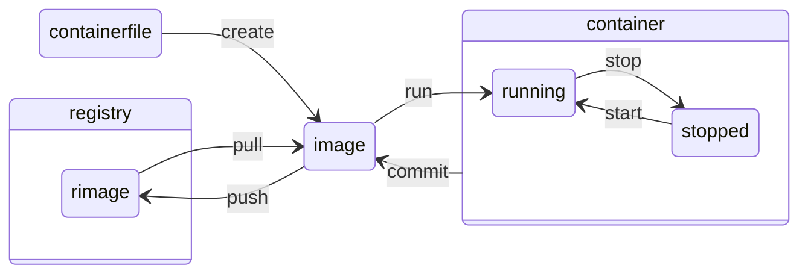

sources:
  + https://docs.docker.com/reference/ - about pretty much everything regarding docker
  + https://docs.docker.com/engine/reference/commandline/ - about command line interface stuff
  + https://docs.docker.com/engine/reference/commandline/ps/ (answered half of my questions about flage `--filter`)

---

A container is an environment started from an image.
An image is built by executing a containerfile.




## containerfile

Each instruction creates one layer:
+ `FROM` creates a layer from a Docker image.
+ `COPY` adds files from your Docker client’s current directory.
+ `ADD` adds tar file exctraction and remote address functionality to `COPY`...
+ `RUN` specifies q command to run within the container
+ `CMD` can be called only once (if ignored only the last line with `CMD` will be executed) specifies what command to run within the container

shortest container image file could be
```
FROM ubuntu:latest
```
