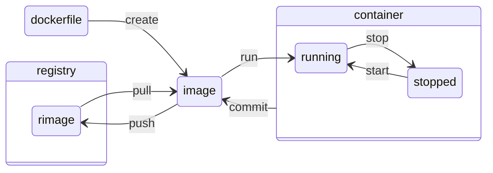

sources:
+ a
+ https://docs.docker.com/engine/reference/builder/
+ 
+ 


---

Docker container is a running docker image and a docker image is built by executing a dockerfile.  



---

# commands

sources:
  + https://docs.docker.com/engine/reference/commandline/


```bash
Management Commands:
  builder     Manage builds
  config      Manage Docker configs
  container   Manage containers
  context     Manage contexts
  image       Manage images
  manifest    Manage Docker image manifests and manifest lists
  network     Manage networks
  node        Manage Swarm nodes
  plugin      Manage plugins
  secret      Manage Docker secrets
  service     Manage services
  stack       Manage Docker stacks
  swarm       Manage Swarm
  system      Manage Docker
  trust       Manage trust on Docker images
  volume      Manage volumes
```


+ `docker`
  + `image`
    + `build`
    + `pull`
    + `load`
    + `import`
    + `build`
    + `ls`
    + `inspect`
    + `prune`
    + `rm`
    + `save`
    + `push`
    + `tag`
  + `container`
    + `create`
    + `inspect`
    + `logs`
    + `ls`
    + `pause`
    + `port`
    + `prune`
    + `rename`
    + `restart`
    + `rm`
    + `run`
    + `start`
    + `stat`
    + `stop`
    + `top`
    + `unpause`
    + `update`
    + `wait`
  + `volume`
    + `create`
    + `inspect`
    + `ls`
    + `prune`
    + `rm`
  + ``
  + ``
  + ``
  + ...


## flags 
flags added to the command can  
+ change the verbosity of each element outputted by filtering properties of each outputted element
+ reduce the output in the amount by filtering elements

possible flags are:  
+ `--filter` reduce the output in the amount by filtering elements (passing some elements an some not, based on properties per element)
+ `--format` change the verbosity of each element outputted by filtering properties of each outputted element
  +`--format {{.Name}}`
  +`--format {{.ID}}`
  +`--format {{.Name .ID}}`
+ 
