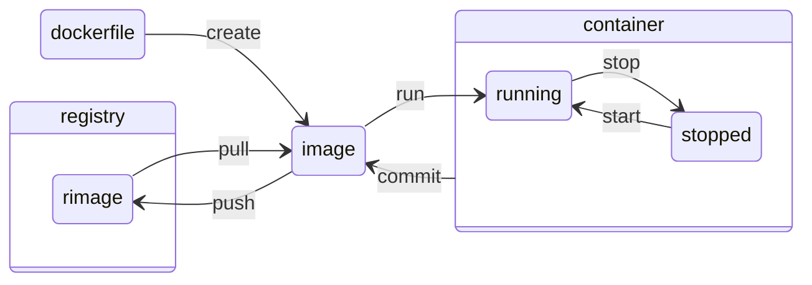

sources:
  + https://docs.docker.com/reference/ - about pretty much everything regarding docker
  + https://docs.docker.com/engine/reference/commandline/ - about command line interface stuff
  + https://docs.docker.com/engine/reference/commandline/ps/ (answered half of my questions about flage `--filter`)

---

Docker container is a running docker image and a docker image is built by executing a dockerfile.  

