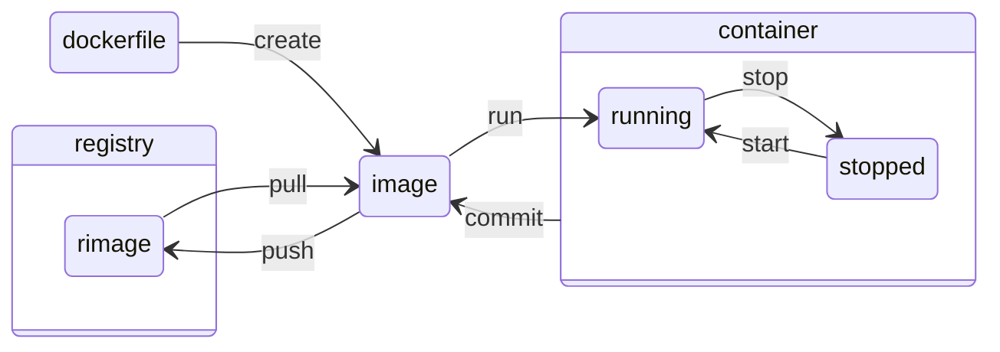

sources:
+ a
+ https://docs.docker.com/engine/reference/builder/
+ 
+ 

---

Docker container is a running docker image and a docker image is built by executing a dockerfile.  

---

# Docker file

Each instruction creates one layer:
+ `FROM` creates a layer from a Docker image.
+ `COPY` adds files from your Docker client’s current directory.
+ `ADD` adds tar file exctraction and remote address functionality to `COPY`...
+ `RUN` specifies q command to run within the container
+ `CMD` can be called only once (if ignored only the last line with `CMD` will be executed) specifies what command to run within the container
